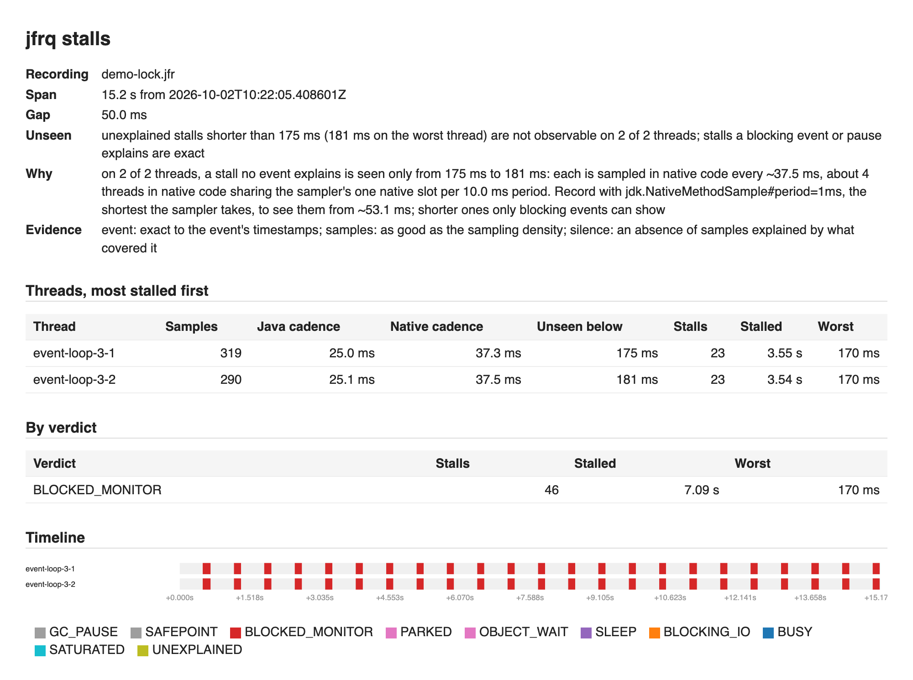

# jfrq

**Ask a Java Flight Recorder recording one question. Get a verdict, with its evidence.**

[](https://github.com/marregui/jfr/actions/workflows/build.yml)
[](LICENSE)
[](docs/USAGE.md#1-requirements)

```
$ jfrq locks demo-lock.jfr --top 3
Recording  demo-lock.jfr  15.2 s  starting 2026-10-02T10:22:05.408601Z
Thresholds JavaMonitorEnter 1.00 ms, ThreadPark 1.00 ms
Blocked    7.14 s across 51 waits

LOCKS BY TOTAL WAIT
  Lock                                      Kind       Total  Waits      Max  Waiters                         Held by
  dev.jfrq.demo.SessionRegistry@7818113800  monitor   7.09 s     46   170 ms  event-loop-3-2, event-loop-3-1  housekeeper
  dev.jfrq.demo.Persistence@7818178000      monitor  46.7 ms      4  17.4 ms  housekeeper                     persistence-flusher
  int[]@7818111500                          monitor  1.05 ms      1  1.05 ms  event-loop-3-1                  event-loop-3-2

WHERE THEY WAITED (the longest wait for each lock above)
  dev.jfrq.demo.SessionRegistry@7818113800  170 ms
        at dev.jfrq.demo.SessionRegistry.touch(SessionRegistry.java:29)
        at dev.jfrq.demo.RequestHandler.channelRead0(RequestHandler.java:49)
  ...
```

In a 15.2 s recording, the two event loops spent 7.09 s between them blocked on one
monitor, held by the `housekeeper` thread, which was itself waiting on
`persistence-flusher`. `--html` writes the same answer as a self-contained page; this is
`stalls` on the same file:



## Why

JDK Mission Control shows the data; `jfr view` prints aggregate tables. Neither answers:

| Question | Command |
|---|---|
| Why did the event loop stop at 14:03:07: a lock, a blocking socket or file call, a sleep, a GC pause, or CPU-bound code? | `jfrq stalls` |
| Which locks did threads wait for, who held them, and which holders were themselves blocked (convoys)? | `jfrq locks` |
| Which threads, classes and sites allocate, in bytes per second, and what changed since the recording before the fix? | `jfrq alloc` |
| What did the JVM report about itself that points at trouble: failed evacuations, full GCs, heap floors that climb, throwables by site? | `jfrq health` |
| What is in the file: span, threads and their CPU, event counts, and the thresholds that limit what it can show? | `jfrq info` |

- **One pass over the file.** A 40 MB recording is answered in about 0.25 s.
- **No dependencies** beyond the JDK.
- **Text, HTML or JSON.** Text for a terminal or a ticket, `--html` for a self-contained
  report, `--json` for a program or an agent ([schema](docs/JSON.md)).

## Every number states its basis

- A number that rests on sampling says so, and says how far the sampling can be trusted.
  `stalls` opens by stating how long a stall no event explains can be and still go unseen.
- The allocation estimate is printed next to the JVM's own counters.
- Every stall names its evidence: a blocking event (exact), a run of samples, or a
  silence explained by what covered it.
- A truncated file is read as far as it goes, and the report says where it stops. A file
  still being written is refused, with the command that makes it readable.

## Quick start

Build (JDK 25):

```
git clone https://github.com/marregui/jfr.git && cd jfr
./gradlew installDist
export PATH="$PWD/cli/build/install/jfrq/bin:$PWD/live/build/install/jfrq-live/bin:$PWD/netty-demo/build/install/netty-demo/bin:$PATH"
```

Try it on the bundled Netty demo, which injects a lock convoy into its event loops:

```
netty-demo --scenario lock --duration 15s --out demo-lock.jfr
jfrq stalls demo-lock.jfr --thread 'event-loop-*'
jfrq locks  demo-lock.jfr --html locks.html
```

Then on your own service. Recordings from any JDK 17+ JVM are read; the
[recommended settings](docs/RECORDING.md#2-the-recommended-settings) also record waits
down to 1 ms, where the JDK's own settings stop at 10 ms (`profile`) or 20 ms (`default`):

```
java -XX:StartFlightRecording=filename=app.jfr,settings=profile -jar app.jar
jfrq info   app.jfr                          # thread names, and what the recording can show
jfrq stalls app.jfr --thread 'my-loop-*'
```

A JVM that is still running has no finished file. `jfrq-live` dumps a window from it and
asks the question of that, and a `delta` holds only what happened since the last dump:

```
jfrq-live 4242 start --max-age 10m
jfrq-live 4242 delta -- stalls --thread 'event-loop-*'
```

## Documentation

The index is [docs/README.md](docs/README.md).

| Document | Contents |
|---|---|
| [TUTORIAL.md](docs/TUTORIAL.md) | Four injected event-loop pathologies, recorded and diagnosed step by step (about fifteen minutes) |
| [USAGE.md](docs/USAGE.md) | Every command and option, output rules, exit status |
| [RECORDING.md](docs/RECORDING.md) | What JFR records, and the settings that give `jfrq` a complete answer |
| [LIVE.md](docs/LIVE.md) | `jfrq-live`: dumps, the cursor, deltas, bounds |
| [JSON.md](docs/JSON.md) | The `--json` schema |
| [design/](docs/design/README.md) | The overall design, with one document per command: how each detector works, the JFR events it reads, and what it cannot see |

## Status

0.1.0. The command-line interface and the report layouts may change. The verdicts and
the numbers behind them are tested against synthetic timelines and against real
recordings made in the test suite.

## License

Apache License 2.0 ([LICENSE](LICENSE)). Copyright 2026 Miguel Arregui.
