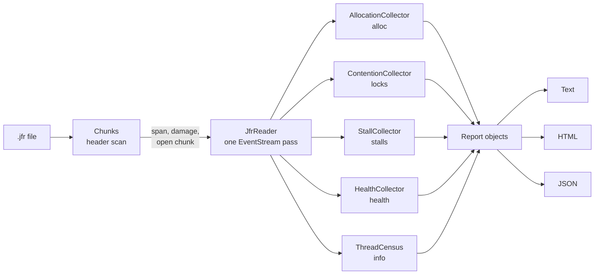
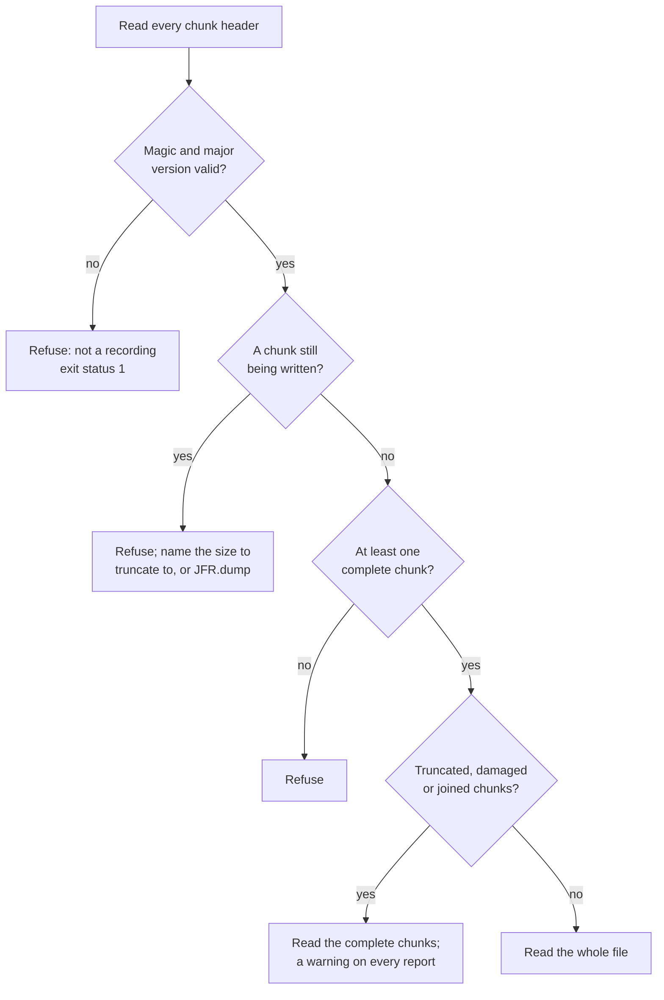

# Design

How `jfrq` turns a recording into a verdict, which JFR events each answer rests on, and
where the evidence runs out. Read this before trusting a result you did not expect.

## Contents

- [At a glance](#at-a-glance)
- [Per-command design](#per-command-design)
- [1. One pass, several sinks](#1-one-pass-several-sinks)
- [2. Output](#2-output)
- [3. Damaged and unusual files](#3-damaged-and-unusual-files)
- [4. Testing](#4-testing)
- [5. Performance](#5-performance)
  - [5.1 The per-event path](#51-the-per-event-path)
- [6. Known limits, in one place](#6-known-limits-in-one-place)
- [7. Source layout](#7-source-layout)

## At a glance

A command reads the file once. The chunk headers are checked first; then one
`EventStream` pass feeds every event the command subscribed to into its sinks, which
keep only what their analysis needs. When the pass ends, each sink's results become a
report object, and the three renderers print that same object, so text, HTML and JSON carry the same numbers.



Each command attaches only the sinks it needs, and the reader subscribes only to the
event types those sinks ask for; everything else is skipped by the parser ([section 5](#5-performance)).

## Per-command design

| Document | Command | What it explains |
|---|---|---|
| [stalls.md](stalls.md) | `stalls` | Idle detection, the three kinds of evidence, measured sampling cadence, pauses, merging |
| [locks.md](locks.md) | `locks` | Waiting for work versus contention, holder resolution, convoys, perches, moved locks |
| [alloc.md](alloc.md) | `alloc` | The weighted estimate, first samples, counter calibration, sites, `--baseline` |
| [health.md](health.md) | `health` | Findings, trends, throwables, thread CPU, native memory, several recordings |
| [info.md](info.md) | `info` | Settings, thread families and census, attached threads, CPU per family, starts |

## 1. One pass, several sinks

A recording is read once, event by event, through `jdk.jfr.consumer.EventStream`.
`JfrReader` subscribes to exactly the event types its sinks want, dispatches each event
to them and, on the way, collects the `RecordingInfo`: the time span, event counts per
type, the set of threads, and the active settings. The choice of `EventStream` over
`RecordingFile` is a performance one, explained in [section 5](#5-performance): the stream parser skips
unsubscribed event types at the byte level instead of materialising them.

Before the pass, the chunk headers are read directly from the file (`Chunks`). A
recording is a sequence of chunks, each with a 68-byte header that carries the chunk's
size and exact time span, so the headers give the recording's *data span* (earliest chunk
start to latest chunk end) without depending on which events were subscribed, on which
settings were active, or on any other recording that happened to be running in the JVM.
Nothing widens it, so every command reports the same span for the same file: an event
that sticks out of the last chunk (a safepoint the final rotation ends a millisecond
late) is clipped by the analyses like a wait that began before the recording.
The span is not taken from `jdk.ActiveRecording`: a JVM usually runs a continuous
recording next to an on-demand one, and the on-demand file carries `jdk.ActiveRecording`
events for both. Anchored on the earliest recording start, a one-second dump took the
age of the continuous recording as its span, and every rate was divided by it.

The headers also say whether the file is whole. A chunk whose declared size runs past
the end of the file is a truncated recording; the JDK parser stops at it without an
error, so a full disk would read as "no stalls found".

A chunk whose size fits but whose
last constant pool and metadata are not where its header points (both are events of known
type at offsets the header gives) was cut short and had something appended: JFR files
concatenate, and `head -c` of one recording followed by another reads, to the JDK parser,
as a two-minute chunk with no events and nothing after it. Behind a damaged chunk the scan
looks for the next intact one. The magic alone does not find it: every flush writes a
copy of the chunk header into the chunk, marked as still being written, so a flushed chunk
is full of headers that are not chunks. `jfrq` reads every complete chunk, from a
temporary copy without the damage when complete chunks sit behind it, prints a warning on
every report naming the damaged bytes and the time span their header declared, and
refuses the file when no chunk is complete.

A chunk whose file-state byte is not zero is one still being written: a copy of a live
recording, or what a killed JVM left behind. The JVM rewrites the chunk's size
and duration at every flush, so those say nothing on their own; the state byte is what
it clears when it closes the chunk, and the JDK parser keys on the same byte. It does
not fail on an open chunk; it polls the header until the byte clears, without a
timeout. `jfrq`
refuses such a file before the parser sees it and says how to get a readable one
(`jcmd <pid> JFR.dump`, or, when complete chunks precede the open one, truncate to them).

The outcome of the header checks, before any event is parsed:



The settings come from `jdk.ActiveSetting` events, which carry an event-type id, a
setting name and a value (`"10 ms"`, `"300/s"`, `"true"`). Every JDK profile
(`default.jfc`, `profile.jfc`) enables them; a `Recording` built by hand may not, in
which case `RecordingInfo.hasSettings()` is false and every report says so instead of
printing thresholds it does not know.

Memory is bounded by what the sinks keep, not by the file. The allocation sink keeps
aggregates; the contention sink keeps one small record per wait; the stall sink keeps
samples and blocking events only for the threads that match the filter, plus every
thread's monitor waits (one small record each, however many the file holds) to resolve
lock holders and every thread's parks (three longs, a thread and a stack each) to decide
which locks are a loop's perch. Stacks and frames are interned for the duration of a pass, so a million samples over a few
thousand distinct stacks retain a few thousand stacks.

Timestamps are carried as nanoseconds since the epoch in `long`s. `Interval` is
half-open, `[start, end)`.

## 2. Output

Text goes to standard output in fixed-width tables meant for tickets and chat; each
stall line ends with `[samples]` or `[silence]` unless it came from an event. A stall
list prints each distinct stack once and later rows say `same stack as #n`: every stall
keeps its own row, because they are separate occurrences and not one aggregate, but one
lock convoying two event loops filled fifteen rows with the same seven lines: 138 lines
of report where 54 carry the same content. Both renderers do it, each keyed on its own
rendering, since the text list elides at six frames and the HTML table at twelve. `--html`
writes one self-contained file: no scripts, no external resources, inline SVG
timelines with a box per stall (or per wait) and a tooltip with the detail. A timeline
row draws at most 2,000 boxes, the longest ones: a recording with a 1 ms threshold can
hold hundreds of thousands of waits, which drawn in full make a file of hundreds of
megabytes.
`--json` writes one document for a program to read, with the field names as the contract
(docs/JSON.md). Text, HTML and JSON come from the same report objects and take the same
`--top`, so they carry the same numbers.

The summary comes first. A `stalls --thread '*'` run on a live node was 235 lines, and
its `PER THREAD` table listed all 134 threads alphabetically, most with no stall, after
the stall list: the reader, human or agent, read the evidence before its summary. The
text report opens with `BY VERDICT` and `PER THREAD`, as the HTML
page always did, and lists only the threads that stalled, most stalled first, bounded by
`--top`, with one line counting the rest; what the others cannot show is the `Unseen`
line's to say ([stalls.md, section 3](stalls.md#3-sampling-cadence-is-measured-not-assumed)). The same run is 93 lines.

Times are UTC, and say so: the report header prints an ISO instant, `jfrq-live` its clock
times as `12:23:21.688Z`, and a dump's default file name is stamped in UTC. A recording is
read on other machines and next to other tools' output, where a clock time without a
zone is ambiguous.

## 3. Damaged and unusual files

- **Not a recording, empty, or a future format version:** refused with a one-line
  message and exit status 1. The chunk header's magic and major version are checked
  before the JDK parser is involved.
- **Truncated** (the disk filled up, a copy was cut short): the complete chunks are read
  and every report carries a warning naming the chunk the file ends inside. A file with no
  complete chunk is refused. A chunk whose size field claims more bytes than the file has
  left, however large (a damaged header), is the same case.
- **Cut and joined** (a truncated file with another recording appended, or bytes that are
  no chunk between two that are): the complete chunks on either side are read and the
  warning gives the damaged byte range, with the time span its header declared when it
  has one. A join across the damage is judged against that declared span ([section 1](#1-one-pass-several-sinks)).
- **Still being written** (a live recording copied from under the JVM): refused. When
  complete chunks precede the open one, the message gives the size to truncate the file
  to; when the open chunk is the only one there is nothing to keep, and the message says
  to dump the recording instead. The JDK parser would otherwise poll, without a timeout,
  for the chunk to finish; see [section 1](#1-one-pass-several-sinks). Questioning a running JVM is what `jfrq-live`
  is for ([LIVE.md](../LIVE.md)): it takes windowed dumps, which are finished files.
- **Damaged inside a chunk** (the framing holds, the bytes within it do not): the JDK
  parser ends the stream quietly on an `IOException` (the data runs out, a size exceeds
  what is left, a constant pool entry does not parse), and the answer stands on the events
  read before it. Any other exception fails the read: `failed while reading the recording
  (damaged file?)` with the exception, exit status 1. A class or method name left null by
  a damaged constant pool is reported as `null`. An exception thrown while jfrq handles an
  event does not end the pass: the event is left out, and every report carries a warning
  with the number of events left out and the first exception.
- **Several recordings in one JVM:** the span is the file's own ([section 1](#1-one-pass-several-sinks)); the
  settings reported are the last chunk's, since settings can change between chunks.
- **Files joined** (`cat a.jfr b.jfr`, which the JDK parser reads without a warning): the
  JVM starts each chunk of a recording exactly where the previous one ended, so a chunk
  that starts more than a millisecond after that is a hole no run recorded, and one that
  starts before it comes from another run. Either is a warning on every report: the span
  covers both files, so rates over it are diluted, and a silence across the hole is not
  a stall.
- **A blocking call still in progress when the recording stopped** is not in the file at
  all: JFR writes an event when it ends. The stall it caused ends with the recording as
  far as any tool can tell, and `stalls` reports it as the silence after the thread's
  last sample when the recording bounds the thread's life ([stalls.md, section 2](stalls.md#2-evidence)); its detail says
  it runs to the thread's last moment in the recording.

## 4. Testing

- Pure logic (`StallAnalysis`, `ContentionReport`, `AllocationDiff`, the formatters,
  the matchers) is tested on hand-built timelines with exact expectations.
- The JFR path is tested on recordings made in-process by the test itself: a named
  thread that idles in a known Java method, sleeps, burns CPU, blocks on a monitor,
  parks on a `ReentrantLock`, waits on an object and reads from a slow socket; an
  allocating thread; a contended monitor with a known holder. Assertions are on
  verdicts, holders and orders of magnitude, not on exact durations, so they hold on a
  loaded CI machine.
- The CLI is tested end to end, command by command, on one such recording, including
  usage errors and exit codes, and on damaged copies of it: cut mid-chunk, cut after a
  complete chunk, cut inside the next header, and junk. The live-file refusal is tested
  on a copy of a real repository chunk taken while the JVM is writing it.
- The two-recordings span and the safepoint-by-VM-operation cases are tested on
  recordings made for them: an on-demand recording dumped while an older one runs, and
  two hundred parked threads dumped with `SafepointEnd` disabled.
- `health`'s evacuation-failure finding needs a heap with no room left, which the test
  JVM does not have: the test starts a JVM of its own with a 48 MB heap held nearly full,
  records it, and checks the count of failed collections against the file's own `gcId`s.
- JaCoCo enforces line coverage of 85 % on `core` and 80 % on `cli` and `live` in
  `./gradlew check`.

## 5. Performance

Measured on a 38 MB, 1.4-million-event recording of the demo (`all`, unpaced, 90 s;
1.08 M of the events are `jdk.GCPhaseParallel`) and on the 0.6 MB tutorial recording,
wall-clock, warm file cache, Apple silicon, JDK 25. "Before" is the first working
version; "after" is the current one.

| Command | Before | After |
|---|---|---|
| `stalls`, 38 MB | 0.68 s | 0.25 s |
| `locks`, 38 MB | 0.53 s | 0.16 s |
| `alloc`, 38 MB | 0.72 s | 0.24 s |
| `alloc --baseline`, 38 MB × 2 | 1.29 s | 0.36 s |
| `info`, 38 MB (reads everything) | 0.48 s | 0.38 s |
| `stalls`, 0.6 MB | 0.45 s | 0.15 s |
| `info`, 0.6 MB | 0.48 s | 0.11 s |

`--timing` prints three phases: `parse`, `analyse` and `render`. The analysis runs
inside the read, in the sinks' `finish()`, so a single "read" number could not say which
of the two a change had moved. Under `alloc --baseline` the two files are read at once,
and `analyse` is the `finish()` time of whichever read ended last (the reader keeps one
number per process), with `parse` the rest of the wall-clock read: the sum is exact, the
split only indicative. What produced the numbers,
in order of effect:

1. **Parse only what is asked for.** `EventStream` with a handler per subscribed type
   makes the JDK parser skip the payload of every other event; `setReuse(true)` recycles
   the event object and `setOrdered(false)` skips the per-chunk time sort. For the
   filtered commands this halved the read. `info` still parses everything and is bound
   by the JDK parser; the JDK's own `jfr summary` is faster only because it reads chunk
   headers instead of events.
2. **Resolve pool objects once.** Every field access on a `RecordedObject` is a linear
   by-name scan of its descriptors, and `RecordedClass.getName()` re-derives the name
   on each call; a twenty-frame stack costs about a hundred such lookups. The objects a
   chunk's constant pools resolve to (`RecordedStackTrace`, `RecordedThread`,
   `RecordedClass`) are shared instances, so `Interner` remembers the first resolution
   by identity. That took `alloc` from 440 ms to 180 ms of reading, and `info` from
   580 ms to 310 ms from the thread lookup alone. Identity caches are bounded and
   rebuilt when full, so a long recording cannot pin every chunk's pools.
3. **Hash stacks once.** `Stack` is a class with a cached hash rather than a record, and
   interning makes equal stacks one instance, so aggregation maps compare by identity
   first.
4. **Decide idleness per frame, not per sample.** `IdleMatcher` runs its regular
   expressions once per distinct frame.
5. **Window every interval lookup.** Blocks, pauses, event stalls and per-thread waits
   are sorted by start; with the longest element remembered, a lookup binary-searches
   to the first candidate that can overlap and stops at the first that starts too late.
   Convoy search walks heads in descending duration and stops once `top` are found.
   These do not show in the table above (the analysis is under 40 ms on this file); they
   keep it that way on files with hundreds of thousands of waits or stalls.
6. **Build the HTML only when asked.** The report is built behind a supplier, so nothing
   is rendered without `--html`; it lists at most
   `max(--top, 100)` stalls with stacks, and escapes text without a regex per cell.
7. **Read two files at once.** `--baseline` parses both recordings on virtual threads;
   the parser is single-threaded per file.
8. **Start faster.** The launcher runs the JVM with `-XX:+AutoCreateSharedArchive`, so
   the first run writes a dynamic AppCDS archive next to the jars and later runs map it
   instead of loading and verifying `jdk.jfr` and the tool again: 0.45 s to 0.11 s on a
   small file. An unwritable install directory falls back to a normal start without a
   message (`-Xlog:cds*=off`). `-XX:TieredStopAtLevel=1` was measured and rejected: it
   saves a few milliseconds on small files and costs 25 % on a full parse.

### 5.1 The per-event path

`CODING-GUIDELINES.md` applies to everything that runs per event: the reader
resolves an `EventType` object once (by identity) to its name, its `int` tag, its
counter and its sinks, so no string is hashed per event; the interner's value tables are
probed with a frame's components and a stack's frame buffer, so a hit allocates nothing;
thread-filter verdicts, idle verdicts, lock and peer detail strings are decided once and
looked up by probe; aggregation runs on primitive-valued open-addressing maps; safepoints
and GC pauses are kept flat until `finish()`. What still allocates per event is the
`Sample`/`Block`/`Wait` record the analysis consumes and the `Instant` the JDK returns for
an event timestamp.

Measured A/B on a 22 MB, 60-second `netty-demo --scenario all --rate 0` recording (58 k
allocation samples, 11 k sampler events, 3.6 k socket reads), same JVM flags, alternating
runs, read phase as `--timing` reports it (read plus `finish()`), cold start on the left
and the median of 20 in-process iterations on the right:

| Command | Cold, before | Cold, after | Warm, before | Warm, after |
|---|---|---|---|---|
| `alloc` | 151 ms | 137 ms | 37 ms | 28 ms |
| `stalls` | 166 ms | 150 ms | 22 ms | 19 ms |
| `locks` | 109 ms | 98 ms | 14 ms | 13 ms |
| `info` | 225 ms | 212 ms | 95 ms | 89 ms |
| `alloc --baseline` | 296 ms | 269 ms | | |

The warm numbers say where the floor is: the JDK parser. `info`, which parses every
event and does nothing with it, costs 89 ms warm; the analyses add 15–30 ms on top of a
filtered parse. Applying the guidelines removed allocation from that 15–30 ms and
shortened the cold start (less class loading and JIT for a smaller working set); it did
not change the order of magnitude. Text and HTML output are byte-identical before
and after on every command; the one exception is the order of rows with an identical
delta in `alloc --baseline`, which is hash-map order in both.

Taking the span from the chunk headers alone ([section 1](#1-one-pass-several-sinks)) also removed the
reader's own end-time read on every event, one `Instant` each: `info` on a 33 MB demo
recording went from 235 ms to 213 ms of `parse` (median of four alternating runs).

On a loaded node's recording whose `locks` report lists 13 000 waits, `render` took
68 ms: every section is computed from the waits, and two were computed twice, the ranked locks (for the table and for its
stacks) and the waits sorted longest first (for the convoys and for `LONGEST WAITS`).
`ContentionReport` computes each once and sums a lock's totals in one map lookup per
wait instead of four: 42 ms (medians of fifteen alternating runs). The holder chain of
[locks.md](locks.md) is indexed by lock, then thread, in end order, so each step is one binary
search; on a node whose chains reach 88 threads (56 000 steps over 2 900 monitor waits)
`locks` `analyse` went from 159 ms to 138 ms and `stalls` `analyse` from 72 ms to 80–88 ms.

Field reads were the next cost once `stalls` read every thread's parks. Each optional
field was read as `hasField` then a getter, and the JDK's typed getters
(`getThread`, `getClass`, `getString`, `getStackTrace`) check the declared type with one
more by-name scan before the one that reads, so a lock's class name cost three linear
scans of the event's descriptors on every park and monitor event. The fields the
analyses read are `int` tags (`Fields`); which of them an event type has is one
`long` mask, resolved with `hasField` on the first event of each `EventType` object and
then by identity (the interner checks the last type first, so every sink's lookups on
one event hit that entry). A present field is read with one `getValue` scan and an
`instanceof`; the typed getter runs only when that yields `null` or an unexpected type,
so results and exceptions are the JDK's. The consumer API has no read by index, so one
scan per value read remains. Median `parse` of fifteen alternating cold runs, and median
in-process time of the last twenty of thirty runs (warm, whole command), same JVM flags:

| Command | Cold, before | Cold, after | Warm, before | Warm, after |
|---|---|---|---|---|
| `stalls --thread 'milo-*'`, 5.7 MB v2 load recording | 157 ms | 134 ms | 39 ms | 35 ms |
| `stalls --thread '*'`, same file | 157 ms | 132 ms | 47 ms | 41 ms |
| `stalls --thread '*'`, 33 MB demo recording | 124 ms | 110 ms | 36 ms | 36 ms |
| `locks`, 33 MB demo recording | 98 ms | 90 ms | 23 ms | 22 ms |
| `alloc`, 33 MB demo recording | 196 ms | 175 ms | 44 ms | 38 ms |

Output is byte-identical before and after on `stalls`, `locks`, `alloc` and `info` of
both files.

Labelling the pieces of a moved lock ([locks.md](locks.md)) costs `locks` its read of
`jdk.GCPhasePause` and both commands a pass over every park lock one thread alone waited
on. Median of three alternating cold runs on a 19.8 MB, 22-minute recording of a loaded
node, `--thread '*'`: `locks` analyse 121 → 129 ms and `stalls` analyse 149 → 164 ms;
parse within run-to-run variation for both (58 pause events against 277 thousand parks).

## 6. Known limits, in one place

- A wait shorter than the recording's threshold for its event does not exist in the
  file. Record with 1 ms thresholds when hunting sub-20 ms stalls.
- `PARKED` never names an owner: JFR does not know who holds a `java.util.concurrent`
  lock.
- A wait or a stall that straddles an end of the recording is counted only for the part
  inside it ([locks.md](locks.md), [stalls.md, section 5](stalls.md#5-merging-and-reporting) and [section 2](#2-output)), so the same wait reads shorter in a narrow window than
  in a wide one. The `locks` note and the `stalls` warning say when this happened.
  Neither a `stalls` per-thread share nor a `locks` one can exceed 100 %: a thread's
  stalls are disjoint ([stalls.md, section 5](stalls.md#5-merging-and-reporting)).
- Unexplained silences below `3 × routine absence` are invisible; the `Unseen` line says on
  how many threads, why, and which sampling period would help ([stalls.md, section 3](stalls.md#3-sampling-cadence-is-measured-not-assumed)). A thread is
  sampled at best every 1 ms times the threads sharing its slot; below that, lowering the
  blocking thresholds so the explanation comes from events, or running fewer threads in
  native code during the recording, are the remedies.
- A throttled event type (`jdk.SocketRead` at 300/s in the JDK's `profile` settings) is
  sampled, not recorded in full; the warning names it, and `throttle=off` in the
  recording settings removes the limit.
- The allocation estimate omits each thread's first sample ([alloc.md](alloc.md)); a thread
  that was sampled once in the whole recording contributes nothing to the estimate, and
  its JVM counter, when there is one, is the number to read.
- Allocation on virtual threads is mostly missing from the estimate: each virtual thread
  loses its first sample, which carries its carrier's history, and most are sampled once.
  The warning prints how many samples and bytes were left out. It is not a floor either:
  a virtual thread that moved to a carrier not yet sampled in the recording carries that
  carrier's history on a later sample, at most one sample per carrier. A single virtual
  thread's row is carrier-scoped, and there is no JVM counter for a virtual thread; a
  carrier's counter covers the virtual threads it ran ([alloc.md](alloc.md)).
- `SATURATED` needs five samples and `BUSY` two on its culprit; with the `default`
  settings' 20 ms period and a 50 ms gap that is most of the run, so short saturated
  bursts go unreported rather than misreported.
- A thread blocked through the whole recording, with nothing ending inside it, is in no
  event at all; a matching thread the recording saw only in other events is named in a
  warning, with nothing to judge it by.
- A thread that waits for a result with a timeout, from one place, times out at least twice
  and spends more than half its life in those timed-out waits looks exactly like a timer
  loop, and its waits are set aside as scheduled idle ([stalls.md, section 5](stalls.md#5-merging-and-reporting)). The warning names the five
  threads with the most time set aside and counts the rest; `--idle none` reports them as stalls.
- Lock addresses move with the objects; a lock that was compacted mid-recording appears
  under several addresses, and each piece can fall under a perch's half-window line. Such
  pieces are labelled as probably one moved lock ([locks.md](locks.md)) but never set aside, so an
  idle thread's moved mailbox stays in `Blocked` and in the parked stalls, with the label
  and its odds next to it. A short recording, a few long waits, or a collector that moves
  objects between its pauses (ZGC, Shenandoah) can leave too little evidence for the label.
  A thread whose own allocation sets off a collection per request can earn the label
  without a moved lock, which is why it is only a label.
- An address a second object takes later merges the two into one lock. `locks` then judges
  it by the stack of its longer wait, and `stalls`, which matches each wait's own stack,
  can disagree: on one recording three 5 s polls of a directory monitor shared an address
  with a logger's 60 s wait, and were contention in `locks` and idle in `stalls`.
- `health` cannot see the JVM's own `OutOfMemoryError` (the heap, metaspace) or any
  `StackOverflowError`: JFR does not record them ([health.md](health.md)). For the heap, a failed
  evacuation or a full collection is the warning it can give.
- `health`'s count of throwables created covers the stretch between the first and last
  `jdk.ExceptionStatistics` reading, once a second in both settings files; a burst in the
  last second of a recording is in the events but not the count.
- A loop whose parks are mostly shorter than the `jdk.ThreadPark` threshold shows only the
  parks above it, so its idle time can fall far short of a perch's half window. On a broker
  of a three-node cluster, the JGroups bundler thread's recorded waits on its own condition
  came to 3 102 parks and 1m18s, 7.0 % of an 18-minute window at a 10 ms threshold, below
  the 9.8 % of the busiest contended queue measured in [locks.md](locks.md); no shape tells the two
  apart. A rule for several waiters on one condition, each parked over half the window,
  was measured on fifteen recordings before it was written: every lock it would have
  matched was a `ThreadPoolExecutor.getTask` pool the idle list already names, so it was not
  added. `--idle` with the loop's frame, or a 1 ms threshold, is the remedy.
- `jdk.ThreadCPULoad` covers Java threads only (the compilers' threads among them): the
  collector's threads are in the JVM's total and in no family's `CPU`. A thread's reading at
  the first evaluation in the file is left out unless its start is in the file ([info.md](info.md)),
  so a recording shorter than two periods (20 s at the JDK settings' 10 s) shows little for
  the threads that were already running; an attached thread's readings up to its first one
  below one core are left out too ([info.md](info.md)), apart from the VM's own `main`'s; the line
  under the table says how many readings were left out. An evaluation at which a single
  other thread had a reading is not recognised as one, and a reading after it is weighed from the instant before, which
  overstates it. Whether `jdk.ThreadStart` was on is the last chunk's setting: a recording
  that turned it on partway through weighs a thread started before that, and with no start
  in the file, as alive since the recording began; 100 threads of 50 ms each, 60 of them
  before the switch, read 41.8 % for the 3.9 % they used.
- Verdicts name threads by the name JFR recorded for them. On JDK 25 a thread renamed
  after it started keeps the name it started with in every event (verified on a 21-chunk
  recording of a thread renamed a thousand times), so a pool that renames its workers per
  task shows none of the task names.

## 7. Source layout

```
core/         the analyses, one pass over the file, no dependencies
cli/          the jfrq command: argument parsing and text rendering
live/         the jfrq-live command: dumps from a running JVM, the cursor, the span check
netty-demo/   the demo service and its scenarios
docs/         README.md (the index), TUTORIAL.md, USAGE.md, RECORDING.md, LIVE.md, JSON.md;
              design/ holds the design: README.md and one file per command
ci/           what CI runs beyond the build: the installed tools on a live JVM (Smoke.java,
              Workload.java), and the per-module test report (TestReport.java)
config/       the Checkstyle rule set (unused imports only)
```
