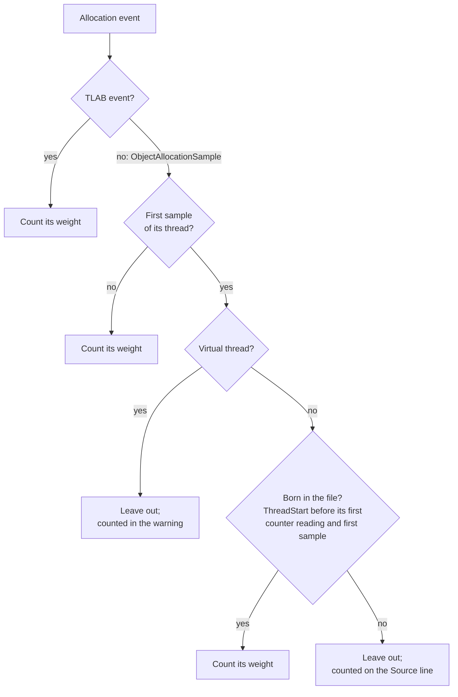

# Design: `alloc`

Part of the [design](README.md). How `alloc` estimates allocation from samples, checks the estimate against the JVM's own counters, groups sites and compares two recordings.

**Events.** `jdk.ObjectAllocationSample` (JDK 16+): a throttled sample whose `weight`
is the number of bytes it stands for, i.e. the bytes allocated on that thread since the
previous sample. Summing weights gives an unbiased estimate of bytes allocated; counting
samples does not. When the sampled event is absent the
analysis falls back to `jdk.ObjectAllocationInNewTLAB` (weight: the TLAB size) and
`jdk.ObjectAllocationOutsideTLAB` (weight: the allocation size), which is how JDK 11-15
recordings and explicitly configured profiles report allocation.

**The first sample of every thread not born in the file is discarded.** A sample's weight is
the bytes the thread allocated since it was *last sampled*, and for a thread that was never
sampled, or not since a recording hours earlier, that is its lifetime allocation. Left in, a
main thread that allocated 150 MB of `MemberName` at start-up and nothing since is reported
as allocating 150 MB during the recording (measured on the tutorial's demo).
Dropping the sample loses at most the bytes between the previous sample and this one,
nothing for a thread sampled hundreds of times a second and unknowable for one sampled
once. A platform thread born in the file keeps its first sample: its lifetime began inside
the recording, so all of that weight is in the window, and dropping it lost most of what
short-lived pool threads allocated. Born means a `jdk.ThreadStart` no later than the thread's
first counter reading and its first sample, because a `jdk.ThreadStart` in the file is not
proof: the JVM that starts a recording with `-XX:StartFlightRecording` writes one for `main`
up to seconds after main has been sampled and counted, and taken at its word main's 21 MB of
start-up allocation became the recording's. The `Source` line says how many first samples
were left out, which is why the sample count is short of the events (the JSON has both). The
TLAB events carry no such history and are used as they are.

Which allocation events count toward the estimate:

**Virtual threads lose theirs too, and the report says how much that was.** The JVM
counts allocation per carrier, not per virtual thread, so the weight of a sample taken on
a virtual thread is what its *carrier* allocated since the carrier was last sampled,
under whichever virtual threads it ran in between. A carrier that has not been sampled
since it started, which is every carrier the first time the event is enabled, puts its
whole history on its first sample: on a JVM that had run virtual threads before the
recording, 64 of them allocating 67 MB inside a recording were reported at 3.35 GB when
their first samples were kept. The event names the virtual thread, not the carrier, so
that sample cannot be told apart from one that holds only the virtual thread's bytes.
Dropping every virtual thread's first sample removes it whenever it lands on one, and the
estimate stays below the actual allocation at the cost of most virtual-thread allocation: a virtual thread is typically sampled
once or never, and the same run was reported at 4.2 MB. `alloc` therefore prints a
warning whenever a virtual thread lost a sample, with the count and the bytes left out
(`61 first samples of virtual threads, 3.35 GB, not counted`); those bytes include the
carriers' history, so they can be far more than what was left out.

The rule does not make the estimate a floor. A virtual thread that blocks is unmounted
and can resume on another carrier; when that carrier had not been sampled in the
recording yet, its history lands on the virtual thread's second or later sample and is
kept. With 64 virtual threads that sleep between allocations, 268 MB allocated in the
recording was estimated at 403 MB and 466 MB in two runs, one virtual thread carrying
337 MB on a single sample. There are about as many carriers as cores, so at most that
many samples can do it; the warning says so. A single virtual thread's row is the
carrier bytes it happened to be sampled on, not what it allocated.

**Calibration.** `jdk.ThreadAllocationStatistics`, written at every chunk boundary by
the JDK's own settings, is each thread's exact allocation counter. The difference between
a thread's last counter and its first is what it allocated in between, and a thread whose
`jdk.ThreadStart` is in the file had a counter of zero then; the report prints that next to
the estimate, overall and per thread, so the reader sees how far the sampling is from the
exact count on those threads. The two only compare over the same stretch, so the
estimate set against a counter is the thread's samples between those two points, which is
why the collector keeps every platform thread's samples with their times (the samples are
throttled, some 17 MB an hour at 300 a second; the unthrottled TLAB events, which run to
millions a minute, are kept per 100 ms a thread allocated in, so each end of their stretch is
off by at most 50 ms of allocation; virtual threads, which have no counter, keep none). Set against
the whole file instead, a pool thread that started after the first chunk had its early
allocation in the estimate and not in its counter: a 26-minute node recording in six
chunks read as an estimate 28 % high whose samples were right, and is 2 % low measured
over the stretches. A thread's row shows its counter only when that stretch holds 95 % of
the row's estimate; beside the whole-file figure, one pool thread's counter read 0 against
212 MB. A thread that started and ended between two counter events has no counter; the
comparison is restricted to the threads that have one, so the two numbers compare like
for like. The percentage is printed only when those threads carry at least 1 % of the
estimate: below that the two differ by start-up effects (the counters are read a few
milliseconds after sampling begins, and on the thread that starts the recording those
milliseconds are JFR's own initialisation), and the percentage would measure those
effects, not the sampling. The share
is the *estimate* on those threads, not their counters: a thread whose counter grew by a
gigabyte while it was sampled for 1 MB of a 200 MB estimate is half a percent of the
report, and so is any error measured on it.

`jdk.ThreadAllocationStatistics` is written per platform thread, so there is no counter for
a virtual thread and its row has an empty `Counted` cell. The carriers
(`ForkJoinPool-1-worker-N`) do have counters, and theirs include every virtual thread they
ran, but the samples name the virtual threads, so a counted carrier
adds its counter to the comparison with no estimate against it and pulls the percentage
down. When most of the allocation is on virtual threads the share rule keeps the
percentage off the line; in a mix of the two, the per-thread `Counted` column of the
platform threads is the comparison to read.

The line also says what share of the estimate those threads carry, because that is what
the percentage validates and nothing more. On a server whose work runs on pool threads
that live and die inside the window, the counted threads can be a third of the estimate
while the transient ones did the other two thirds; an unqualified "±2 %" would read as the
error of the whole report.

**A site is a method, not a path to it.** One logical allocation reaches the sampler down
many paths: the same method allocating on two of its own lines, the same line under a
different depth of library frames, a string built by `substring` here and `copyOfRange`
there. Folded by what they print, `BY SITE` on a loaded node showed `NodeId.parse` as four
rows of about 2 % each, when the method was 20.8 % of everything the JVM allocated. The
key is therefore the **culprit method**: the innermost frame outside the
JDK, without its line number. Every path through it is one row, the row says how many
stacks it summed, and the stack printed under it is the biggest of them. The raw per-stack
map is untouched underneath, and so is the per-stack comparison `--baseline` is built on.

A stack is its frames' classes, methods and lines, plus whether each frame is native (the
one part of the frame type that is printed, as `Native Method`). JFR also tags every frame
`Interpreted`, `JIT compiled` or `Inlined`, which says what the JIT had done with the method
at that instant; kept in the key, the same line sampled before and after compilation was
two stacks that print identically. On the loaded node above, `NodeId.toParseableString`
said "215 stacks" for 98 distinct ones, and the stack printed under it carried 23.4 MB
while the stack as printed carried 36.5 MB. The same identity is what `locks` and `stalls`
compare stacks by.

**`--app` when the culprit is a library.** The culprit rule stops at the innermost non-JDK
frame, which for `NodeId.parse` is a third-party class the reader cannot change; what they
want is their own line that called it. jfrq cannot infer which packages are theirs — a JVM
started from a jar records `sun.java.command = app.jar` and no package name anywhere — so
`--app com.example` says it, and the fold then keys on the innermost frame in those
packages, falling back to the culprit for a stack that never enters them. A prefix ends
at a name boundary, `.` or `$`, not anywhere in the string: `io.netty` is `io.netty` and
everything under `io.netty.`, and `io.nett` matches neither `io.netty` nor `io.nettyx`; a
class prefix `com.example.Handler` covers its nested classes and lambdas
(`com.example.Handler$Inner`, `com.example.Handler$$Lambda`). So the option
cannot be guessed at, `BY SITE` prints the non-JDK package roots it saw, by bytes; the
report says what to pass it.

**Support.** Every row also carries the number of samples behind it, **summed over every
stack in the row**. Counted per stack, a row whose bytes were ten stacks' showed the
support of one of them: 13 samples, where the row rested on 7 662. The
estimate weights each sample by the bytes it stands for, so two rows of equal size can
rest on 2 000 samples and on 3, and only the count says which; a `--baseline` between two
quiet windows reported `+397 %` and `+469 %` on a base of 143 samples, within sampling
error. The counts cost three more table probes per allocation event: on a
1.3 MB recording of a loaded node the read went from 54.3 ms to 57.2 ms and the analysis
from 0.62 ms to 1.00 ms, measured with `--timing`.

**Aggregation.** Bytes by thread name, by allocated class, and by full stack, plus the
class and stack breakdown per thread. Rates divide by the recording span. Byte units are
decimal (`1 MB` is 1,000,000 bytes), as in `jfr view`; `jfr print` uses binary units.

**Diff.** `--baseline` compares rates, not totals, so recordings of different length are
comparable; threads match by name, classes by name, sites by the same fold the single
report is ranked by, so `--app` groups a diff exactly as it groups one recording. Matched
per stack instead, one site that moved appeared once per path it had been sampled down: a
diff of two loaded windows opened with the same six frames twice, at 302 MB/s and
216 MB/s, and neither number was the change: the site had moved 628 MB/s. Each row also
carries the samples behind both sides, because several hundred percent on a handful of
them is within sampling error. A key missing on one side is reported against zero. Sorting is by absolute
change in rate.

A hidden class is named without the address the JVM gave it:
`Pattern$$Lambda.0x800000030` is `Pattern$$Lambda`, as a class and in a site's method
name, and `LambdaForm$MH.0x…` is `LambdaForm$MH`. The address differs from one JVM to the
next, so a before-and-after pair from two runs listed every lambda twice, as gone on one
side and new on the other: 46 such rows in one A/B diff of two edge nodes, which the fold
takes to none (and the rows that read `new` or `-100 %` from 77 to 43). The price is that
every lambda of one class is one row. A warning both recordings carry, such as the
virtual-thread one, is said once with both counts.

**Limits.** The estimate is statistical. At the JDK's default 150-300 samples per second
it ranks threads and classes and gets shares within a few percent; it cannot show that a
site allocating 0.1 % of the total grew by half. Class names are
JVM names in the file (`[B`) and are printed in source form (`byte[]`).
