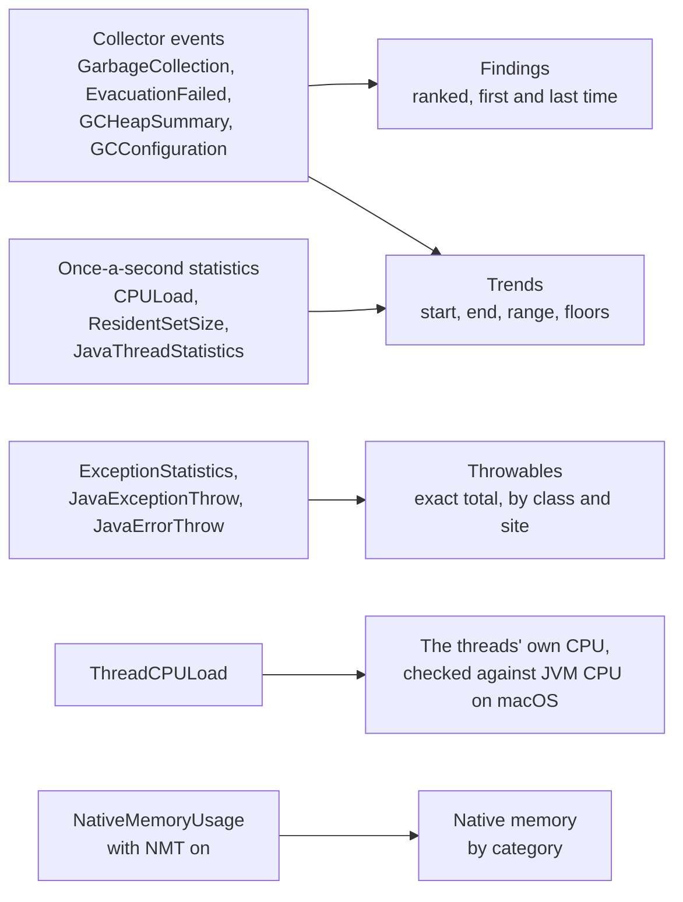

# Design: `health`

Part of the [design](README.md). What `health` reads from the JVM's own reporting, what it calls a finding, and what the recording cannot show.

The other commands answer a question about a problem already seen. A four-minute window
of a soak test held 2,829 throwables, a collection forced by a humongous allocation, and
heap, resident-set and thread counts once a second, and no command read any of it.
`health` reads what the others leave, in one pass: the collector's events
(`jdk.GarbageCollection`, `jdk.OldGarbageCollection`, `jdk.GCHeapSummary`,
`jdk.GCConfiguration`, `jdk.GCHeapConfiguration`, `jdk.EvacuationFailed`), the
once-a-second statistics (`jdk.CPULoad`, `jdk.JavaThreadStatistics`,
`jdk.ResidentSetSize`, `jdk.ExceptionStatistics`) and the throwables
(`jdk.JavaExceptionThrow`, `jdk.JavaErrorThrow`). Both JDK 25 settings files enable all of
them. On the 39-minute soak recording it takes 274 ms, against 327 ms for `info`.

**Findings are only what the JVM reported.** Each is one of a fixed list, ranked in this
order: an `OutOfMemoryError` created; a collection that failed to evacuate; a full
collection (`G1Full`, `SerialOld`, `ParallelOld`); pause time over the JVM's own goal of
`1 / (1 + GCTimeRatio)` of the time (7.7 % for G1's default 12); a pause over
`MaxGCPauseMillis`; a collection caused by a humongous allocation, by the metaspace
threshold, or by `System.gc()`. Each carries its count and when it first and last
happened. The times carry the distinction a rule could not: five metaspace collections
in the first 1.2 s are a JVM starting, and the same five spread over an hour are classes
loaded faster than they are unloaded. `GCConfiguration` reports a pause target only when
one was set; it was unset in every recording examined, so the pause finding is usually
absent rather than passed.

The out-of-memory finding sees only part of what its name says. JFR emits its throwable
events from the constructors, and the JVM makes its own `OutOfMemoryError` (the heap,
metaspace, an array over the size limit) and every `StackOverflowError` without running
one: a JVM driven out of heap three times, past the array limit and out of direct memory
recorded only the last, which `java.nio` constructs in Java. So the finding reports
direct-memory exhaustion, with its message, and says what it cannot see; there is no
stack-overflow finding, since it could only report a `new StackOverflowError()` in
application code. The heap's warning is an evacuation failure instead: G1 found no room
to copy live objects and left them in place. It is counted once per collection (`gcId`),
because one collection can report it more than once. In a 48 MB heap held nearly full, 379 of 779 failed collections
reported it twice.

A cause is counted once per trigger. G1 reports its concurrent marking cycle (`G1Old`)
as a collection of its own, with the cause of the young pause that started it, a
millisecond earlier. Counting both counted every humongous and metaspace trigger twice
(eight humongous collections on the soak recording that were four), so a `G1Old` event
counts as a collection and adds its pauses (remark and cleanup), but not a cause.

**Trends are numbers without a verdict.** Heap after GC, resident set, live threads and
JVM and machine CPU each get their start, end, range, mean, and the floor (the lowest
value) of their first and last thirds. A heap that leaks has a floor that climbs; a busy
heap without a leak has peaks that come and go. A "rising" rule on those floors was
measured and rejected: the 39-minute soak recording starts with the JVM, and its heap
floor climbs from 18 MB to 61 MB as the application warms up. Whether 3 MB of resident
growth in four minutes matters is left to the reader.

**Throwables are counted exactly and ranked from a sample.** `jdk.ExceptionStatistics`
carries the JVM's running total of throwables created. The difference between its first
and last reading is exact, but it covers only that stretch, so on a short recording the
events can outnumber it: the demo recording has 650 events against 596 created in 14.1 s
of its 15.2 s. An `Error` is traced twice in JDK 25, from `Throwable`'s constructor and
again from `Error`'s (`OutOfMemoryError` excepted), each time adding one to the running
total and emitting a `jdk.JavaExceptionThrow`; the second also emits the
`jdk.JavaErrorThrow`. So an event with `Error.<init>` on top is skipped, and the total loses
one per `jdk.JavaErrorThrow` inside its stretch. The test checks the corrected total
against the events inside the stretch, exactly.

A `java.lang.NoSuchMethodError` whose message names a `Holder` class in `java.lang.invoke` (`Invokers$Holder.linkToTargetMethod(...)`) is not a
fault: the JDK links a method handle by looking for a form generated ahead of time,
creates that error when there is none, catches it, and generates the form. JFR records the
creation, so any service that uses lambdas or method handles shows a few, at start-up or
when a call shape is first used (`MemberName.Factory.resolveOrNull` in JDK 25); the demo
shows seven in its first half second, five of them under Netty's cleaner. A count of them
is not a finding.

`jdk.JavaExceptionThrow` fires in the `Throwable` constructor, so it counts creations: an object made only for its stack trace counts, and a rethrow does not. It is
throttled (100/s in `default`, 300/s in `profile`), so the class and site shares are of
the events, and a class's rate is the exact total's rate times its share. That rate is an
average over the window, which a start-up burst and a steady trickle can share: 341
`ClassNotFoundException`s from +5.1 s to +605.6 s read as 0.3/s, half of them made by
+6.0 s. So each class also prints when its first, median and last were made; the median is
near the first for a burst and near the middle for a steady rate, whatever straggler comes
last, which the first and last alone cannot show.

A site is the code that made the throwable. The top of every such stack is its own construction:
`Throwable.<init>`, the superclass constructors (an application's own base exception
among them), the class's constructor, and sometimes a static factory of the class. The
site is the first frame outside the JDK below all that, and the stack shown starts there.
Naming the innermost frame outside the JDK instead would put every subclass of an
application's base exception on the base class's constructor.

**What the threads used, by their own readings.** `jdk.ThreadCPULoad` gives each Java
thread's user and system CPU as a share of the JVM's CPUs since the JVM last evaluated it,
once a period (10 s in both JDK settings files) for every Java thread at one instant, and
once more when a thread ends. The JVM's CPUs are its active processor count: the machine's,
unless `-XX:ActiveProcessorCount`, a container limit or a CPU affinity mask sets fewer, and
the share passes 100 % when the process uses more CPUs than it counts. `jdk.CPULoad`'s JVM
figure divides by the same count on macOS, and by the host's CPUs on Linux (it reads
`/proc/stat`); its machine figure is the host's on both (JDK 25 sources). On macOS the two
compare: an Edge run with `-XX:ActiveProcessorCount=2` on a 12-core machine read 100.9 % for
the JVM and 103.6 % for its threads. On Linux a JVM held to 2 of 12 CPUs reads a sixth of
what its threads read, with both figures correct.

A reading times the stretch it covers is the thread's CPU in it, so their sum
over the window, divided by the window, is the Java threads' share of the JVM's CPUs; the
rule and what it leaves out are [info.md](info.md)'s. A process uses at least the CPU its threads
use, so a `JVM CPU` trend (`jdk.CPULoad`) below it is incorrect where the two divide by
the same count, and `health` puts a warning above everything else when, on a recording whose
`jdk.OSInformation` names Darwin, the threads' figure exceeds the JVM's by half again plus a
point. Elsewhere it does not compare them: on Linux the counts differ whenever the JVM is
held to fewer CPUs than the host, and no other system's source was checked.
The margin covers two figures read over slightly different stretches; the observed fault
is far outside it. JDK 21.0.3 broker JVMs on macOS, in 67 recordings of one soak (64
finished files and the readable chunks of the nodes it killed),
averaged 0.02 % to 0.45 % in `jdk.CPULoad`, no reading above 1.02 %, while `ps` showed them
at 150 % to 236 % of a core and their threads' readings summed to 0.8 % to 16.9 %; the
warning fires on 65 of them. The Edge on JDK 25 in the same runs, 22 recordings, had its
threads at 0.28 to 1.03 times the JVM's figure, 0.93 to 1.03 in 15 of them; the one above
1 is within the margin, and the warning fires on none. The raw events hold the
zeros, so the fault is in what the JVM wrote, not in reading it.

**Native memory, when NMT was on.** A JVM started with `-XX:NativeMemoryTracking=summary`
(or `detail`) writes `jdk.NativeMemoryUsage` per category and `jdk.NativeMemoryUsageTotal`
once a second in both settings files; without NMT it writes none. `health` lists committed
memory, the total first and then the categories largest at the end first, each with the
same start, end, range and floors as a trend. Resident set minus committed is not native
growth: committed heap becomes resident only as it is touched. On one broker the resident set
rose from 155 MB to 2.23 GB in 19 minutes while NMT's committed total rose from 1.22 GB to
1.86 GB, of which the heap was 1.07 GB throughout. Memory a library allocates with `malloc`
(RocksDB's, there) is in no NMT category.

**What holds the heap is not in the file.** When the floor of heap after GC rose from the
first third to the last, `health` says so under the trends, with the size, and that a class
histogram or a heap dump is where the answer is: `jdk.OldObjectSample` names where
surviving objects were allocated, not what keeps them. On an Edge whose heap filled to its
limit, the samples pointed at the code that creates messages; the class histogram showed
510 000 of them held by a task queue. A rise the trends round away is not reported: on a
steady Netty service the floors printed 748 MB and 748 MB, 204 KB apart, and a note under
them that the floor rose contradicted the printed figures.

**A throwable event that was off is said, with the setting.** When the settings show
`jdk.JavaExceptionThrow` disabled (JDK 21's `profile` leaves it off; JDK 25's turns it on),
an empty table says nothing about the application, so `health` prints
`jdk.JavaExceptionThrow#enabled=true`, which `-XX:StartFlightRecording` and
`jcmd <pid> JFR.start` both take (verified on JDK 21.0.3).

**Several recordings, one table.** `health a.jfr b.jfr ...` reads them concurrently, one
virtual thread each as `alloc --baseline` does, and prints a row per recording in the order
given: span, findings, GC time, the longest pause, heap after GC floors, resident set and
live threads from first to last, threads started, the JVM's and the threads' CPU, and
throwables per second, then each recording's warnings and findings under its name. A label
is the file name, or as many directories above it as it takes to tell the recordings apart
(`n1/run/node.jfr`), or its whole path when the same file is given twice, which is a usage
error. The JSON has a `reports` array, each element a `health` document's `recording` and
fields without the envelope (`tool`, `version`, `schema`, `command`), which the comparison
document carries once.

A killed JVM leaves its repository directory of chunks rather than a recording. Given that directory, or
the `repository=` directory that holds one per JVM (named by start time and pid), `jfrq`
points at `jfr assemble`; directories are recognised by the names the JVM gives chunks
(`2026_10_01_13_37_14.jfr`), so a directory of finished recordings is not mistaken for one.
The newest chunk is the one the JVM was writing: unfinished, and unreadable by the JDK's own
`jfr summary` too (it reports the stream stuck in a locked state). `jfrq` refuses the
assembled file for it and names the size to cut it to, which keeps the finished chunks: on a
broker node killed at 14 minutes, three chunks assembled and cut read as 9m51s. A repository
of one chunk holds nothing readable, and the hint says so.
