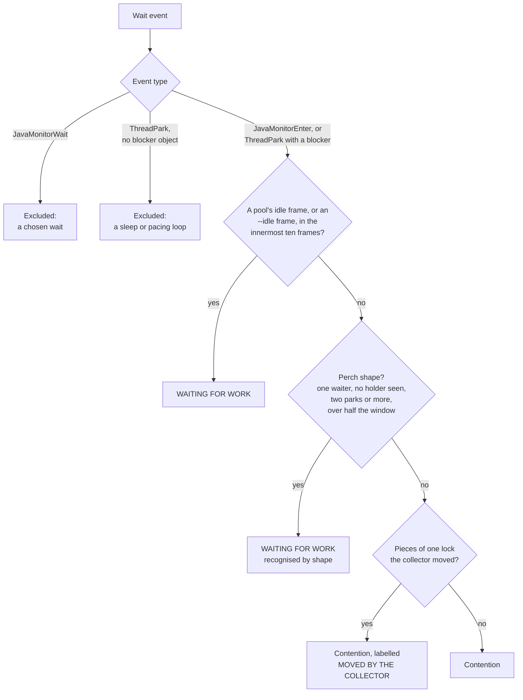
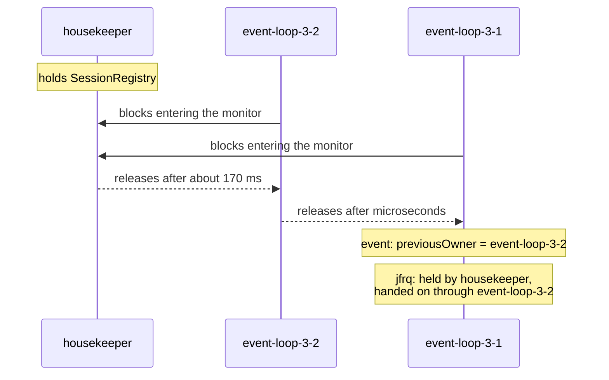

# Design: `locks`

Part of the [design](README.md). How `locks` separates contention from waiting for work, names the thread that held a lock, follows convoys and labels locks the collector moved.

**Events.** `jdk.JavaMonitorEnter` (a contended `synchronized` entry; carries the
monitor class, its address, the previous owner, the duration and the waiter's stack) and
`jdk.ThreadPark` (`LockSupport.park`, which every `java.util.concurrent` lock and queue
ends in; carries the blocker class and address, but no owner, because the JVM does not
know who owns a `ReentrantLock`).

**What is deliberately excluded.** `jdk.JavaMonitorWait` (`Object.wait()`): a thread
in `wait()` chose to wait for a notification; counting it would drown contention under
idle worker pools. Parks with no blocker object: those are `LockSupport.parkNanos`
sleeps and pacing loops.

How `locks` files each wait; the rules are explained in the paragraphs that follow:

**Waiting for work is not contention.** On a server most parks are workers sitting on
their own empty queue. Ranked by duration they outrank every contended lock: in one 2m39s
window of a loaded node, twelve idle pools filled both `LOCKS BY TOTAL WAIT` and `LONGEST
WAITS`, and the one contended monitor (33.8 s across 1 028 waits) appeared in neither.
So a park whose stack shows the *pool's own* idle frame goes to a `WAITING FOR WORK`
section with its own total, and the contention sections are what is left.

The patterns name that frame and nothing else: `ThreadPoolExecutor.getTask`,
`ForkJoinPool.awaitWork`, `DelayedWorkQueue.take`, the common pool's
`DelayScheduler.loop` (its thread only hands due tasks to the pool, so it parks nowhere
else), Netty's `SingleThreadEventExecutor.takeTask`, logback's
`AsyncAppenderBase$Worker.run`. Not the queue class: a request thread waiting for a reply
on a `SynchronousQueue` is contention and looks identical one frame up. Not the worker loop either: `runWorker` is on the
stack while a task is running too. Not `ForkJoinPool.managedBlock`: on JDK 25 every
`CompletableFuture.get` and `join` and every untimed `Condition.await` blocks through it,
so it is under a caller waiting for a result as often as under a worker waiting for work;
listed, it filed 660 stalls of one loaded node's dispatchers as idleness. The frame that
decides sits below the park, the queue and that managed-blocker machinery —
`ThreadPoolExecutor.getTask` is the eighth frame of an idle fixed pool on JDK 25 — so the
innermost ten frames are examined rather than the three a sampled stack needs.
`--idle` replaces the list, `--idle none` turns the split off.

**Holder resolution.** `previousOwner` is the thread that released the monitor to the
waiter. Under contention that is frequently another waiter that got the lock a
microsecond earlier, so the field alone misattributes the hold. `Holders` rebuilds the
chain of holds inside the wait, from its end backwards. The waiter got the lock when its
wait ended. Each thread on the chain got it when its own wait for that lock ended, taking
the one of its waits that ended last at or before its successor (the next thread toward
the waiter) got the lock, and held it from then, or from the start of the waiter's wait
if that is later, until the successor got it; the owner of that wait is the next thread
back. The chain ends at a thread with no such wait, which held the lock from before the
wait began, at an unknown owner, and at a cycle (the waiter cannot hold what it waits for,
and no wait is walked twice). The thread that held the lock longest inside the wait,
summed when it appears more than once, is the holder; the others that held it are the
`via`, the threads it was *handed on through*, in the order they held it, and the text
names four of them and counts the rest (one loaded node had chains of 88 threads). A tie
names the thread nearer the waiter.

Two simpler rules were measured and rejected. Walking back to the first thread that had not itself waited named a thread that held the lock for
the first half-millisecond of a 300 ms wait, not the one that held it for the other
299.5; stopping instead at the first intermediary that got the lock before the middle of
the wait measured its hold from the end of its *longest* wait rather than the last one,
and, two hops back, counted every later thread's hold as its own. On that node the
longest holder was named for 890 of 2 704 waits with more than one holder inside them;
with the chain it is named for all of them. `ContentionReport` and `StallCollector` run
the same `Holders`, so `locks` and `stalls` name the same thread.

The demo's `lock` scenario shows why the event's own field is not enough. Both event loops
queue on the registry while the housekeeper holds it; the housekeeper releases it to
`event-loop-3-2`, which holds it for microseconds and releases it to `event-loop-3-1`. The
event of `event-loop-3-1` names `event-loop-3-2` as the previous owner; the chain names the
housekeeper:

`--thread`, `--min` and `--lock` apply *after* resolution, to what is listed, never to
what is walked: the wait that names the real holder is usually a short one by a thread
the question was not about, and a convoy is followed into whichever thread holds the
lock and whichever lock that thread was waiting for. Convoys are listed for the waits
that pass the filters; their links may belong to any thread and any lock.

**Convoys.** For each wait with a known owner, follow the owner into its own wait for a
*different* lock that overlaps in time, up to a depth of five. A chain of two or more
links is a convoy: the thing the loop waited for was held by a thread that was itself
waiting. Co-waiters for the same lock are not links; they are already folded into `via`.

**Every row carries a stack.** `LOCKS BY TOTAL WAIT` ranks by total, `LONGEST WAITS`
by duration, so a lock made of thousands of short waits tops the first and never appears
in the second, which is where stacks were printed; its row named the lock but not where
it was waited on. Each row takes the stack of its own longest wait, listed under `WHERE THEY WAITED`, and `--lock`
filters the whole report down to one lock by class or by `class@address`.

**`--by-site` ranks the stack, not the instance.** One queue per in-flight request is as
many locks as requests: on a loaded node, fifteen `ConditionObject` addresses held fifteen
rows of `LOCKS BY TOTAL WAIT` and the section below them said "15 locks with this stack".
With `--by-site` the ranking table is grouped the same way the stacks are — one row per
stack, with the instance count, the summed wait and the longest of them — and the grouping
runs over *every* lock rather than the top N, so a site spread across seventy-four
instances outranks one big lock instead of being lost below it. It is an option rather
than the default because the addresses are what `--lock` takes, and a report that never
prints them cannot be narrowed to one. A site is the stack as it prints to six frames,
whichever report asks, and both print it to that depth: when the text grouped at the six
frames it prints and the HTML at its twelve, the same file gave the two reports different
rows and different totals.

**A thread's own perch, measured rather than named.** The idle list above recognises a
pool's own frame, and covers only the runtimes on the list. A service with its own worker
loop is not on it: on one recording, the eight most contended locks were all dispatcher
threads parked on their own mailbox, and naming that frame with `--idle` requires knowing
the codebase. A perch has a shape that needs no list: exactly one thread ever waits there,
no thread was ever found holding it, and that thread is parked there for most of the
recording. On that file the mailboxes covered 76.7 % to 99.9 % of the window, while the
busiest contended queue, a consumer waiting for data another thread had to produce,
covered 9.8 %. The threshold is half the window, with a factor of five to either side.

Two parks are required as well as the share, because one park covering the window is a
thread that is *stuck*, and that must be reported, not filed as idleness; a lock with a
holder is contention whatever its shape. What the
measurement finds is a lock, but what it identifies is the loop above it, so the stack of
each perch answers for every other lock waited on from the same place: one worker out of
thirteen that was busy for two thirds of the recording parks on its own mailbox exactly
like the other twelve, and a threshold deciding between them would leave that one lock,
alone, at the top of the contention it is not part of. `--idle none` turns this off together
with the name list, so one option disables every idle rule. The loop is
compared as it prints, to eight frames, deep enough to reach below the park and the queue
into the loop itself; two stacks that differ only in how a frame was compiled are one loop.
A perch whose parks carry no stack names no loop, and answers for no other lock: every
stackless lock prints the same empty stack, and one of them may be contention. The report
says how many of the locks it lists under `WAITING FOR WORK` were recognised by shape; the
count is of those rows, after the filters, and leaves out a lock the idle list named. On the
recording that raised it, `Blocked` fell from 32m42s to 2m32s and the contended browse
consumer took the top five rows; `stalls`, which asks the same question of its blocks, its
silences and its sample runs, went from 832 stalls on those threads to none.

**One stack per stack, not per lock.** A server that gives every worker its own mailbox
has as many locks as workers and a single stack between them: thirteen dispatcher threads
printed the same seven frames eight times, 66 lines of a 177-line report. `WHERE THEY
WAITED` groups the ranked locks by what their stack *renders to* at the depth being
printed — the same rule the allocation sites are folded by, so whatever prints the same is
one entry — and names the locks the entry stands for, capped like every other name list.
Locks whose longest wait carries no stack are one group too, for the same reason: there is
nothing to tell them apart.

**Lock identity** is class plus address. Addresses are stable only until a collection
moves the object, so the class is always shown and the address only disambiguates. A
move splits a lock in two, which also splits the evidence for a perch: a dispatcher's
mailbox that young collections moved eight times in three minutes was nine locks of about
twenty seconds each, none of them over the line, and one idle thread filled the report
with contention. JFR carries no identity that survives a move, and joining one thread's
locks by class and loop alone would also join distinct objects: on one loaded recording
it would have moved 153 s of listed waits, spread over 32 and 42 addresses on two threads,
into waiting for work, and those were browse consumers waiting for data. What tells the
two apart is when the address changes. An object gets a new address only under a moving
collection, so every change of a moved lock, from one wait to the next, spans a pause;
a thread that waits on a new object per request changes whenever the request does. That
alone is not evidence when the waits are long against the time between pauses: a
consumer waiting 800 ms on a new future per request, with a collection every 200 ms, has a
pause inside every change because it has one inside every wait. So the changes must also
be unlikely to have met their pauses by chance. A change of length `L`, in a stretch whose
`k` pauses come over `T`, meets one by chance at odds of at most `L k / T`; the product
over every change has to be one in a thousand or less. On the recordings above, the moved
locks scored between 10-5 (a monitor polling every 5 s, eight changes in eight
collections) and 10-19, and every thread waiting on a new object per request
either had changes with no pause in them (20 of 31, 28 of 41) or scored 1.

That is evidence, not proof. A counter-case, found in review: a consumer waiting on a new
future per request, whose own work between two waits allocates enough to set off a young
collection every time. Every change then has a pause in it by cause, not chance, and 40
futures on 40 addresses scored 10-4.9; folded into waiting for work, 11.9 s of
a slow downstream would have been reported as "no contention". A pause inside the new wait rather than between waits would stop that case and
not the next (a backend that allocates while it produces each result). So the pieces are
never set aside on this evidence. They are gathered per thread and loop (the park locks
one thread alone waited on, from one loop, whose total has a perch's shape and whose
changes pass both tests; gathering by loop alone would find two waiters in a pool whose
workers each have a moved mailbox) and labelled: `locks` keeps every wait in `Blocked`,
says how much of it is on such locks, and lists them under `MOVED BY THE COLLECTOR` with
the number of addresses, the odds and the stack; `stalls` keeps the parked stalls and
names each such thread in a warning with the same evidence. On the ten recordings of that
node `Blocked` stays about 7m54s and the label accounts for 5m54s of it, all but two 60 s
waits (two waits on two addresses score 1: the recording cannot tell a moved lock from two
objects there); on one of them 35 s more stays unlabelled, a monitor's poll whose address a
logger's condition took later ([README.md, section 6](README.md#6-known-limits-in-one-place)). The report states the evidence and leaves the
judgement to the reader. `WHERE THEY WAITED` shows the pieces of a split lock under one
stack.

**Window semantics.** JFR writes a blocking event when the wait *ends*, so a file holds
waits that began before its first chunk, and a `jfrq-live delta` window cuts waits at both ends. Every wait is therefore counted only for the part inside the
recording's span: a wait of three minutes in a window of two and a half contributes two
and a half. Without that, one thread could be reported as blocked for 112 % of a window,
and the totals said more time was spent waiting than the window contains. The clipping
happens once, in `ContentionReport`, after holder resolution, which runs on the true
intervals — who held a lock does not depend on where the window starts. `--min` applies
to the clipped duration, because it is the duration the report is about, and `LONGEST
WAITS` ranks on it for the same reason; a line under the `Blocked` total says how many
waits were cut. The same rule is applied to `stalls` in [stalls.md, section 5](stalls.md#5-merging-and-reporting).
