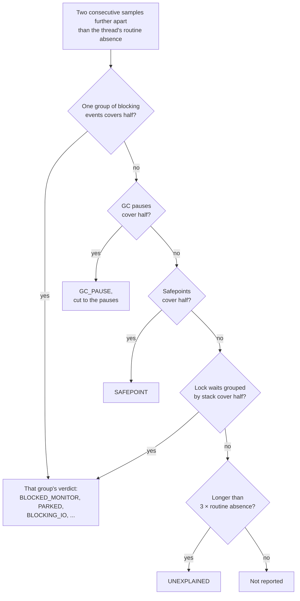
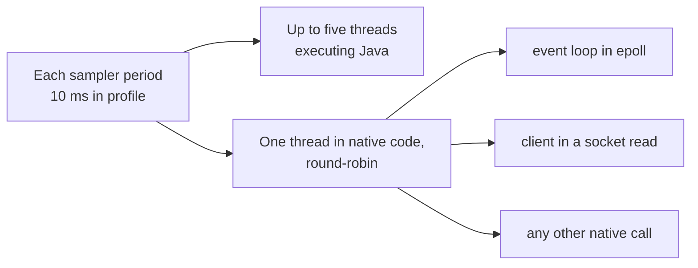
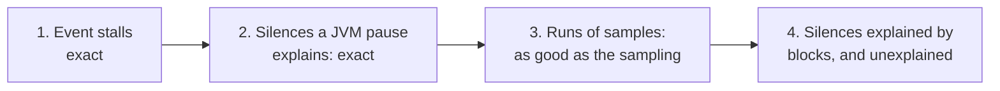

# Design: `stalls`

Part of the [design](README.md). How `stalls` decides when a thread did not return to its idle point, from which evidence, and how far the sampling can be trusted.

- [1. Idle detection](#1-idle-detection)
- [2. Evidence](#2-evidence)
- [3. Sampling cadence is measured, not assumed](#3-sampling-cadence-is-measured-not-assumed)
- [4. Pauses](#4-pauses)
- [5. Merging and reporting](#5-merging-and-reporting)

The question is "why was this event loop not at its selector between t1 and t2", and
the answer is assembled from three kinds of evidence with different reliability.

## 1. Idle detection

A sample is *idle* when one of its innermost three frames matches an idle pattern. The
defaults cover the JDK selectors on every platform (`KQueue.poll`, `EPoll.wait`,
`WEPoll.wait`, `*SelectorImpl.doSelect`, `SelectorImpl.select`), Netty's native
transports (`epoll.Native.epollWait*`, `kqueue.Native.keventWait`, `uring.Native.*Wait*` and `*Enter*`),
`Unsafe.park` / `LockSupport.park*` and `Object.wait*`. `--idle` replaces them with a
comma-separated list of regular expressions, each of which must match a whole
`package.Class.method`; a hand-written poll loop or a queue `take` is one pattern away.

A frame `--idle` names is the thread's idle point for blocking events too: a sleep, an
`Object.wait` or a park whose innermost ten frames show it is the loop with nothing to do
and joins the waiting-for-work rule of [section 5](#5-merging-and-reporting), since a loop that sleeps between polls
would otherwise be reported as stalled in its own sleep. The default patterns are not applied this way,
nor is any pattern that names the wait itself (`Unsafe.park`, `LockSupport.park*`,
`Object.wait*`, `Thread.sleep*`): those frames are under every wait of their kind, and a
sample there is the thread at rest only because the sampler cannot see what it waits for.

## 2. Evidence

**Events** (exact). A blocking event on the thread at least `--gap` long is a stall by
itself:

| Event | Verdict | Detail |
|---|---|---|
| `jdk.JavaMonitorEnter` | `BLOCKED_MONITOR` | lock, resolved holder, intermediaries |
| `jdk.ThreadPark` | `PARKED` | blocker class, or "no blocker object" |
| `jdk.JavaMonitorWait` | `OBJECT_WAIT` | monitor class |
| `jdk.ThreadSleep` | `SLEEP` | |
| `jdk.SocketRead` / `SocketWrite` | `BLOCKING_IO` | peer host and port, bytes |
| `jdk.FileRead` / `FileWrite` / `FileForce` | `BLOCKING_IO` | path, bytes |

Each of these has a threshold in the recording settings; a block shorter than the
threshold is not in the file. `jfrq` warns when a threshold exceeds the gap. The JDK's
`default` and `profile` settings (JDK 25) also *throttle* the socket and file events to
100 or 300 per second across the JVM; on a service doing thousands of short reads a
second, a long read can then be dropped. `jfrq` warns when a throttle is in
force, and the recording line in [RECORDING.md](../RECORDING.md) switches it off.

**Sample runs** (as good as the sampling density). Consecutive non-idle samples chain
into a run when each is within `3 × max(configured period, measured Java cadence)`
of the previous one, capped at the gap or at three periods, whichever is longer. A run at
least the gap long, with at least two samples, is a candidate. Samples further apart do
not chain: nothing proves the thread was busy between them, and a loop that briefly
returned to the selector between two sparse Java samples would otherwise be reported as
busy. The cap stops at three periods because that is the sampler's own resolution: capped
at the gap alone, a gap at or below the period chained nothing, and `--gap 10ms` on a
10 ms recording found one busy run where `--gap 50ms` found twenty-two. Because the limit
can then reach past the gap, two chained samples at least a gap apart end the run when a
JVM pause or the thread's blocking events explain the stretch between them as they would
a silence: a 52 ms collection between two busy samples 56 ms apart, at a 20 ms period,
was folded into a 60 ms `BUSY` instead. An unexplained stretch still chains, so a smaller
gap finds fewer runs only where a pause or blocking events explain the stretch between two
samples, which is then that stall instead. A thread with no
two consecutive Java samples has no Java cadence (`—`) and chains by the period: the
spacing of its native samples is not a measure of running Java. The verdict is `BUSY`
when one culprit frame (the innermost non-JDK frame, or with `--app` the innermost frame
under one of its prefixes, the site key `alloc --app` uses) owns at least half the samples, and
at least two of them, naming it and the share ("50 % of 2 samples" would rest on one
sample); `SATURATED` when no frame dominates and there are at least five samples, which is
a loop with too much work rather than one long task. If blocking events, together and
whatever their kind, cover at least half the run (a synchronous read shows as native
samples in `read0` *and* as `jdk.SocketRead` events), the events win and the verdict is
the largest group's; the detail counts the others when they were needed to reach half.

**Silence** (weakest). Two consecutive samples further apart than the thread's routine
absence indicate a state the sampler cannot observe: blocked, in the VM, at a
safepoint. The silence is attributed to whichever group of blocking events, then GC
pauses, then safepoints covers at least half of it; otherwise it is `UNEXPLAINED`. A
group is one kind of I/O on one peer or path, whatever the byte counts: twelve
20 ms reads from one backend explain a 300 ms silence together, as
`12 × blocking socket read from backend:9000 (1.27 KB)`; lock waits group by instance, so one
lock taken from several places is one answer. What that leaves unexplained is tried again
with lock waits grouped by stack, because an instance is an address and the collector moves
the object a thread parks on: a pool worker idle on its own queue for 3m52s of a 26-minute
node recording parked 122 times on three addresses of one `SynchronousQueue`, none of them
half the silence, and was reported as the recording's longest stall, `UNEXPLAINED`, while its
parks covered 230.6 s of 232.9; by stack they are the worker at rest. Neither key alone
does: by stack only, one monitor taken from two lines of a method split into halves that
covered nothing; by lock class, an idle park on a `ConditionObject` stood for three busy
waits on another and dropped a stall. A stack group whose waits named several
instances names the class (`178 × parked on dev.app.Queue`), and for monitors every thread
that held one of them. Pauses group the same way, and
a silence they explain is cut to them, from the start of the first to the end of the
last: between pauses the thread may have been running, and a stall longer than what
stopped it overstates it. When that stretch is shorter than a gap while the pauses still
cover the silence by the rule blocks are held to (half of it, for a silence past the routine
absence and under two gaps), the silence is theirs whole and the detail says how much of it
they stopped: a 70 ms silence with a 45 ms collection in it read `UNEXPLAINED`, "no blocking
event", beside the collection that explains it. A 300 MB heap under the serial collector silenced a thread for
1.18 s under 128 collections of at most 12.8 ms, and one collection's name on that row
read as a single pause of more than a second; the detail now reads
`128 × GC pause, 1.02 s stopped in total, longest 12.8 ms (GC Pause (gcId 439))`. If
several watched threads have an unexplained silence at the same moment, the detail says
so: a simultaneous silence on several threads is more likely the sampler, or a pause the
recording did not capture, than independent stalls.

The order in which a silence is explained:

Below `3 × routine absence` ([section 3](#3-sampling-cadence-is-measured-not-assumed)), an explanation counts only when it covers a
whole `--gap` on its own.

**The ends of a thread's life.** A call still in progress when the recording stopped is
not in the file ([README.md, section 3](README.md#3-damaged-and-unusual-files)), so a thread stuck from the middle of the recording to its end
leaves nothing but its last sample: between two samples there is no silence to find. When
the recording carries `jdk.ThreadStart` and `jdk.ThreadEnd` (both JDK profiles enable
them), the thread's life inside the window is known — from the span's start or its start
event, to the span's end or its end event — and the stretch before its first sample and
after its last are silences like any other, labelled as reaching the thread's first or
last moment in the recording; a thread never sampled is one silence, its whole life.
Without those events a thread's birth or death cannot be told from a stall, and the ends
are not judged. Two more conditions apply at the ends. An unexplained silence needs a
routine absence to be longer than, which a thread seen fewer than twice does not have, so
for it only an explained one is reported. And the stretch after the last sample of a
thread seen waiting for work where the sampler cannot see it ([section 5](#5-merging-and-reporting)) is not called
unexplained: its last park has most likely not ended yet.

## 3. Sampling cadence is measured, not assumed

Whether a silence is evidence depends on how often the thread is sampled.

The JFR sampler (`jfrThreadSampler.cpp`, unchanged in JDK 25) visits at most
**five threads executing Java and one thread in native code per period**, round-robin
over the thread list. A thread's effective sampling interval therefore depends on how
many threads compete for the same slot. An idle event loop sits in `kqueue`/`epoll`,
which is native code, and shares the single native slot with every thread blocked in a
socket read, a file read, or any other native call. In the demo, eight client threads
in `SocketInputStream.read` push an idle loop's native cadence to 170 ms and more. On
the machine used for the tutorial, consecutive native samples across *all* threads were
about 55 ms apart despite a configured 10 ms period, so the native slot is also slower
than the period suggests.

With *k* threads in native code, each is sampled about every *k* periods: the demo's
event loops shared the native slot with three other threads and were sampled every
~37.5 ms at a 10 ms period.

Threads executing Java are sampled differently: a CPU-bound loop is sampled at close to
the configured period as long as fewer than five threads are in Java at once.

`jfrq` therefore computes per thread, from the recording itself:

- the median spacing between consecutive Java samples (the *Java cadence*, used for run
  chaining) and between consecutive native samples (the *native cadence*, printed); a
  thread with no such pair has none, printed `—`;
- the 90th percentile of each (the *routine absence*), over every consecutive pair when a
  thread has no pair of that kind, since an absence is about any observation.

An *unexplained* silence counts as evidence only when it exceeds
`3 × max(Java p90, native p90)`, whatever the neighbouring samples showed, because
between any two samples the thread may have passed through the other state unseen. The
PER THREAD table prints that threshold as `Unseen below`, and a dash when it is past the
recording's length, where nothing the samples could show would count. An explained silence does not
depend on it, with one condition: below the threshold, what explains it must itself cover
a whole gap, because the thread may have been idle for the rest; above it, half of the
silence is enough, because the silence is evidence in its own right. Event stalls never
depend on it.

**The verdict comes first.** On a live node, `stalls` on 24 event loops printed `0 found`,
above three per-thread warnings, "21 more", and a table of zeros; the answer to "did the
loops stall" was "this recording cannot see a loop stall shorter than 1.75 s unless an
event explains it", and the report did not say so first. So an `Unseen` line leads the report,
before the warnings and the stalls, one per kind of limit, and an empty stall list points
at it. The kind decides the remedy:

- *The sampler's pace.* A thread where one slot can see it for at least half its life,
  whose routine absence is mostly that slot's round trip (at most twice it), is limited by
  the sampler. Its share is estimated from the round-robin: when a slot is contended, every
  thread that sat in its state all along gets the same, highest, sample rate, so a thread's
  rate against the highest rate of that kind, over every thread in the recording, watched
  or not, is the share of its life the slot could see it in (inferred from the sampler's
  design; threads with fewer than ten samples set no rate). The round trip is the gap
  between samples of the most-sampled thread. The line says how often each is sampled, how
  many threads share the slot (round trip over period), and the period that would do:
  a thread's absence is the round trip, which scales with the period, plus time of its own,
  which does not, so the shortest visible stall at period *p* is
  `3 × (absence − round trip × (1 − p / period))`. The JFR sampler takes no period shorter
  than 1 ms: on JDK 25, with twenty threads in native socket reads, 20 ms sampled each
  every ~454 ms, 10 ms every ~233 ms, 1 ms every ~25 ms, and 0.5 ms the same as 1 ms. The
  prediction overestimates: 10 ms predicted ~97 ms at 1 ms, and a recording at
  1 ms measured 76.8 ms, because the part the model calls the thread's own is taken from
  the 90th percentile. On the node, 1 ms would take the loops from 1.75 s to ~123 ms.
- *The thread's own absences.* Everything else with a blind spot: idle workers and timers
  parked where no slot sees them, and threads seen in long bursts, like the demo's loops
  blocked on the registry for stretches of a quarter of a second. No period helps much,
  the line says so, and blocking events are what show their stalls.

## 4. Pauses

`jdk.GCPhasePause` gives the stop-the-world interval of each collection. Every other
safepoint is assembled from `jdk.SafepointBegin` (the time to bring the threads to a
halt) and `jdk.ExecuteVMOperation` (the operation that ran while they were halted),
joined on `safepointId`; the operation names the pause, `VM operation ThreadDump`,
`VM operation Deoptimize`, which is the part a reader can act on. `jdk.SafepointEnd`
is used when present, but the JDK's own `default` and `profile` settings disable it,
which is why the operation event is required: with the end event alone a
safepoint would be only its sync phase, and a 300 ms thread dump would explain nothing.
An operation whose begin event fell under the recording's threshold stands alone. A
safepoint that overlaps a GC pause is the GC's own and is dropped as a duplicate. Pauses
at least the gap long are listed once, globally, rather than once per watched thread;
they explain silences per thread.

## 5. Merging and reporting

A thread's stalls are disjoint: no moment of its life is counted twice, so its
"stalled" total never exceeds its life in the window. Where evidence overlaps, the stronger
claims the time and the weaker keeps only what is left:

1. Event stalls, exact. A blocking event that begins inside an earlier one is part of it:
   nested it adds nothing, overlapping it keeps only what it adds past the end, if that is
   still a gap long. Joined files ([README.md, section 3](README.md#3-damaged-and-unusual-files)) are where two copies of one sleep met.
2. Silences a JVM pause explains, cut to the pauses, which are exact too.
3. Runs of samples, as good as the sampling, up to their last sample.
4. Silences explained by blocks, and unexplained ones: the weakest evidence.

Each tier claims its time before the next; a later tier keeps only what is left.

A silence or a run that the event stalls already cover by half between them is dropped
whole: two one-minute waits inside a silence of 2m22s, each a stall of its own, otherwise
came back as a third stall the length of both. Anything else that overlaps a stronger
stall is cut to the time left, and each piece at least a gap long is judged again, as the
same kind of candidate, rather than trimmed: the explanation of the whole may rest on the
very events that now stand as stalls of their own. On one load-test thread a
`29 × parked` silence of 649 ms held one 127 ms park listed as its own stall; on the
demo, a client thread whose short parks and socket reads interleave was stalled 18.0 s in
a 15.2 s recording, each read counted once as an event and again inside the silence of
parks around it. A run's tail, one sampler period estimated past its last sample, gives
way to a stall that starts inside it. The report sorts by duration, summarises by verdict
and by thread, and lists the JVM-wide pauses.

The same waiting-for-work rule as [locks.md](locks.md) applies to blocking events: a park, a wait
or a sleep whose stack shows a pool's own idle frame, a frame `--idle` names ([section 1](#1-idle-detection)),
or the loop the `locks` shape rule recognised in this recording, is not a stall,
however long it is, and a warning says how many were left out and what they totalled.
The shape rule is decided as `locks` decides it, on every thread's parks and before any
filter: watched alone, one of two threads sharing a queue looked like the queue's only
waiter, and one dispatcher out of thirteen went from 86 stalls to none when its twelve
siblings were watched with it. A park with no blocker object never makes a perch: every
`parkNanos` in the JVM shares that one "lock", and a retry loop's backoff would be filed
away as its idle point. Weighing every thread's parks costs about 15 ms of reading (8 %) on a
5.7 MB recording with 55 thousand of them when `--thread` selects a few threads.

The rule runs at three points: on the event, on a silence's explanation, and on the
explanation of a run of samples. The third is needed because the sampler sees a park as native code rather than as the thread's idle point, so a worker's
own waiting chains into runs and would otherwise come back as a stall after being kept out
of the other two. A stack is matched there on what its frames say, not on the stack object:
a blocking event and a sample taken in the same park are two stacks with one meaning. The
block stays in the timeline, because it is still what explains the silence in the
samples: dropped outright, a 1m10s idle worker became a 1m10s `UNEXPLAINED` stall. The
same check therefore runs on the explanation of a
silence as well as on the event itself.

**A thread that never rests is labelled, not dropped.** Profiling a batch program (jfrc's
own `main`, 2026-10-04) gave a hundred `SATURATED` rows for one thread that never reached
an idle point: one stretch of work, split wherever its samples paused. When a matched
thread has at least 50 samples, none of them idle, and enough of them that one per
sampling period covers half the stretch from its first to its last, a warning names it
with the count of its `BUSY` and `SATURATED` stalls. The stalls stay, counted: an event
loop that never returns to idle is lag, the worst stall there is, and the recording cannot
tell it from a batch thread. The coverage test is what separates busy from unseen: the
sampler visits only running threads, and a v1 Edge pool thread seen 119 times in a minute
(v1load.jfr) is never caught resting because it is rarely caught at all. On the 31
recordings of the parity corpus the warning fires on none.

**Timer loops are scheduled idle.** With `--thread '*'` on a live node, every one of the
top 25 stalls and 99 % of the stalled time were threads waiting on purpose: a cleaner, a
configuration poll in `wait(60 s)`, two `java.util.Timer` threads, a wheel timer's 2,634
sleeps of 100 ms. The recording says which waits were the thread's own choice of time:
`jdk.JavaMonitorWait` carries `timedOut`, `jdk.ThreadPark` its `timeout` (nanoseconds) or
`until` (an epoch-millisecond deadline) to hold its duration against, and `jdk.ThreadSleep`
its `time`. The deadline is read from the wall clock and the event's end is JFR's tick
clock placed on it at the chunk's start, and the two can disagree by a clock tick: on
Windows a 150 ms `parkUntil` that ran its course was seen ending before its deadline, so an
end within 16 ms of the deadline counts. A wait that ran out its own timeout was not held
up by anyone. It is not idle
by that alone: an event loop that sleeps is a stall this command must report, and a
caller whose `get` with a timeout gave up waited the whole time without a result. So the
rule takes the shape `Perch` takes ([locks.md](locks.md)), per thread: waits from one place (the loop
as its stack prints) that ran out their timeout at least twice and, those waits alone,
for more than half the thread's life in the window. Every wait from that place is then the
thread at rest, including one something woke early, since a timer thread is woken whenever
a sooner task is scheduled, and it is kept out at all three points, like a worker waiting
for work, with one warning that counts the waits and names the threads. On that node the
rule set aside 2,930 waits, 20m41s, on five threads, exactly the count of those waits in
the file, and the stall count fell from 3,147 to 206; across seven recordings of that
service every thread it named was a timer. An event loop at its selector cannot meet the
half-life line with its sleeps, and one timed-out `get` cannot meet the count. Being events
only, the rule is exact. `--idle none` turns it off.

Every stall is clipped to the recording's span, for the reason [locks.md](locks.md) gives for
waits: a blocking event that began before the file, or was still running at its end, is
in the file whole, and counted whole it puts more time in the window than the window
holds. The gap is then applied to the clipped length — 700 ms of blocking with 20 ms of
it inside the window is not a 50 ms stall — and a warning says how many stalls were cut.
A busy run's tail, which is an estimate (one sampler period past its last sample), stops
at the end of the recording for the same reason. It also gives way to a silence stall
that starts inside it, so the two stay disjoint, and a run the cut leaves shorter than a gap is dropped: only the
estimate made it a gap long, and the estimate is the part that gave way. Before that rule a
randomised test found a 43 ms run kept against a 46 ms gap; `stalls --thread '*'` on the 15
recordings of two earlier soak rounds listed 26 such runs, in 7 of them, of 40.4 to 49.9 ms
against a 50 ms gap, which the rule removes and nothing else. Silences need no clipping:
they are bounded by two samples, or by a sample and an end of the thread's life inside the span,
all inside it by construction.

**Unexplained gaps are ranked apart.** A gap with no event and too few samples is often
the longest stall in a report and the one with the least evidence: a 47.4 s
`UNEXPLAINED` outranked a 17.1 s park with a stack on the same page. The verdict stays;
the ranking changes, because a gap and a park are different kinds of claim. They
are listed under their own heading, after the stalls with an explanation, with the count
of `jdk.SocketWrite` events in the file beside them — a recording that streamed gigabytes
can hold sixteen, because an HTTP stack that buffers its own writes produces none, and a
gap on a thread that was writing a response is then all the evidence there is. Both kinds
still count in `BY VERDICT` and in the per-thread totals.
